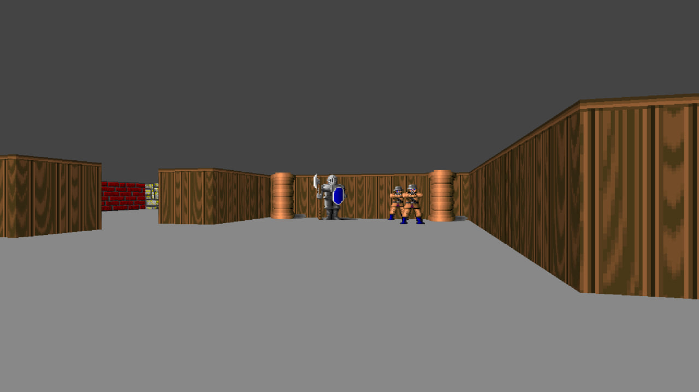
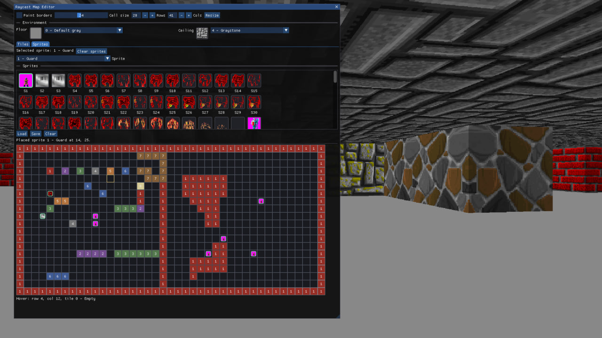
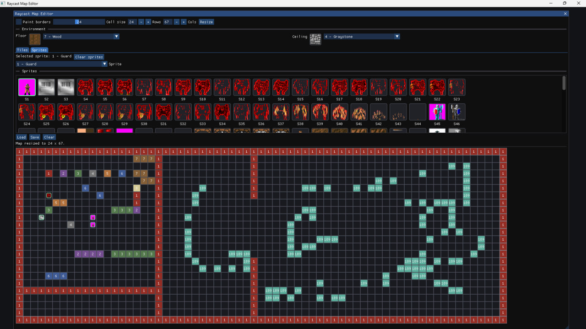

# RaycastEngine

RaycastEngine is a small C/C++ raycasting engine with an SDL2 software renderer and an ImGui-based map editor. The project renders a Wolfenstein-style 2.5D scene from a tile map, with textured walls, floor and ceiling projection, billboard sprites, doors, and a debug minimap.

The project builds two applications:

- `RaycastEngineApp` - the main game/runtime executable.
- `RaycastMapEditor` - the standalone map editor executable.


The editor is also linked into the game and can be opened with `F1`.


## Features

- Software raycasting renderer with one ray per screen column.
- Textured wall projection with vertical-side shading.
- Textured floor and ceiling projection.
- Billboard sprite rendering with distance sorting and wall occlusion.
- PNG sprite transparency through the alpha channel.
- BMP sprite transparency through red/magenta chroma-key backgrounds.
- Door tiles with automatic open/close behavior based on player distance.
- Debug minimap with map cells, rays, the player marker, and sprite markers.
- ImGui map editor embedded in the game and available as a standalone tool.
- Automatic `resources` copy into the build output directory.
- CMake build configured to generate a Visual Studio `.sln` solution, not `.slnx`.

## Project Layout

```text
RaycastEngine/
  CMakeLists.txt
  README.md
  .gitignore
  dev_ops/
    build_app.bat
    clean_build.bat
  resources/
    images/
      *.png
      walls/
        *.bmp
    maps/
      map_01.txt
    sprites/
      *.bmp
      *.png
  src/
    Core/
      Graphics.c/.h
      Map.c/.h
      Player.c/.h
      Ray.c/.h
      Sprite.c/.h
      Textures.c/.h
      Wall.c/.h
      upng.c/.h
      Utilities/
        Deffinitions.h
        MacroFunction.h
        Utils.c/.h
    Editor/
      Editor.cpp/.h
      MapEditorApp.cpp
    Game/
      Main.c
```

## Source Modules

`src/Core` contains shared runtime code used by both applications:

- `Graphics` initializes SDL, owns the software color buffer, uploads the buffer to an SDL texture, and exposes primitive drawing helpers.
- `Map` stores the tile grid, handles resizing, doors, floor/ceiling texture selection, map loading/saving, and minimap wall drawing.
- `Player` stores player position, movement state, and movement settings.
- `Ray` casts the screen-column rays used by wall projection and visibility checks.
- `Wall` renders walls, floor, and ceiling.
- `Sprite` stores placed sprite instances, loads/saves sprite placement data, sorts visible sprites, and renders sprite projection.
- `Textures` loads built-in PNG textures, wall BMP textures, and sprite BMP/PNG textures.
- `upng` is the embedded PNG decoder.
- `Utilities` contains shared constants, macros, and math helpers.

`src/Game` contains the game entry point:

- `Main.c` initializes SDL, loads resources and the map, processes input, updates the simulation, renders the world, and toggles the embedded editor.

`src/Editor` contains editor code:

- `Editor.cpp/.h` implements the ImGui editor UI.
- `MapEditorApp.cpp` is the standalone editor entry point.

## Requirements

- Windows.
- Visual Studio 2022 with C++ build tools.
- CMake 3.16 or newer.
- Git available in `PATH` for first-time dependency downloads through CMake `FetchContent`.
- Internet access during the first configure step if SDL2 and ImGui are not already available locally.

Language standards:

- C11 for `.c` files.
- C++17 for editor and ImGui sources.

Dependencies:

- SDL2.
- Dear ImGui.
- uPNG, embedded in `src/Core/upng.c`.

SDL2 is first resolved through `find_package(SDL2 CONFIG)`. If no package is found, CMake downloads SDL2 through `FetchContent`. ImGui is also downloaded through `FetchContent`.

## Building with the Batch Script

Recommended build command:

```bat
dev_ops\build_app.bat Release App
```

Other useful variants:

```bat
dev_ops\build_app.bat Debug App
dev_ops\build_app.bat Release Editor
dev_ops\build_app.bat Release All
```

Arguments:

- `Debug` or `Release` - build configuration.
- `App` or `Game` - build `RaycastEngineApp`.
- `Editor` - build `RaycastMapEditor`.
- `All` - build both applications.

If no arguments are provided, the script asks for the configuration and target interactively.

The script uses this CMake generator:

```text
Visual Studio 17 2022
```

This is intentional so CMake generates a regular `.sln` solution.

Build outputs:

```text
build\Debug\RaycastEngineApp.exe
build\Debug\RaycastMapEditor.exe
build\Release\RaycastEngineApp.exe
build\Release\RaycastMapEditor.exe
```

## Building Directly with CMake

Configure:

```bat
cmake -S . -B build -G "Visual Studio 17 2022"
```

Build the game:

```bat
cmake --build build --config Release --target RaycastEngineApp --parallel
```

Build the editor:

```bat
cmake --build build --config Release --target RaycastMapEditor --parallel
```

Build all targets:

```bat
cmake --build build --config Release --parallel
```

## Cleaning the Build Directory

Cleanup script:

```bat
dev_ops\clean_build.bat
```

It deletes only the project build directory:

```text
build
```

By default the script asks for confirmation.

Non-interactive cleanup:

```bat
dev_ops\clean_build.bat /y
```

Supported force flags:

```text
/y
-y
--yes
```

Help:

```bat
dev_ops\clean_build.bat /?
```

## Running

Run the executable from the configuration output directory so the copied `resources` folder is next to it:

```bat
cd build\Release
RaycastEngineApp.exe
```

Standalone editor:

```bat
cd build\Release
RaycastMapEditor.exe
```

CMake copies:

```text
resources -> build\<Config>\resources
```

If you run an executable from another working directory, that working directory must also contain a `resources` folder.

## Game Controls

- `W` or `Up Arrow` - move forward.
- `S` or `Down Arrow` - move backward.
- `A` - strafe left.
- `D` - strafe right.
- `Left Arrow` - turn left.
- `Right Arrow` - turn right.
- `Left Shift` - sprint.
- `F1` - open or close the embedded editor.
- `Esc` - quit the game.

When the embedded editor is open, normal player movement input is disabled so it does not conflict with the UI.

## Map Editor

The editor is available in two modes:

- In-game: run `RaycastEngineApp.exe` and press `F1`.
- Standalone: run `RaycastMapEditor.exe`.

Editor features:

- Load `resources/maps/map_01.txt`.
- Save `resources/maps/map_01.txt`.
- Paint wall tiles.
- Erase tiles.
- Place sprite instances.
- Remove sprite instances.
- Select wall textures from a preview palette.
- Select floor and ceiling textures.
- Select sprite textures from a preview palette.
- Resize the map.
- Clear the map interior.
- Clear all sprites.
- Protect map borders from accidental editing.
- Enable `Paint borders` to edit border cells.
- Adjust cell and thumbnail display sizes.

Mouse behavior:

- Left mouse button paints the selected tile or places the selected sprite.
- Right mouse button erases a tile or removes a sprite.
- Border cells cannot be edited unless `Paint borders` is enabled.

## Resources

All runtime assets live in:

```text
resources
```

Expected runtime paths:

```text
./resources/images
./resources/images/walls
./resources/maps
./resources/sprites
```

### `resources/images`

This folder contains PNG textures used by the built-in texture table in `src/Core/Textures.c`.

Map tile values use one-based texture numbers:

- `0` - empty space.
- `-1` - door.
- `1` - runtime texture index `0`.
- `2` - runtime texture index `1`.
- and so on.

### `resources/images/walls`

This folder contains additional BMP wall textures with numeric names:

```text
0.bmp
1.bmp
2.bmp
...
```

The loader checks names from `0.bmp` through `999.bmp` and adds existing files until `MAX_TEXTURES` is reached.

### `resources/sprites`

This folder contains external sprite textures.

Supported sprite formats:

- `.png`
- `.bmp`

PNG sprites use their alpha channel. RGB PNG files without alpha are loaded as fully opaque.

BMP files do not store alpha, so BMP sprites use chroma-key transparency: if the top-left pixel looks like a red or magenta key color, similar red/magenta pixels are converted to transparent pixels.

Files such as `.gif` and `.jpg` may exist in the resource folder, but the current sprite loader ignores them.

### `resources/maps`

This folder contains map files. The default map path is:

```text
resources/maps/map_01.txt
```

The game and editor use this path by default.

## Map File Format

The loader supports both the old map format and the current saved format.

### Old Format

The old format is exactly `20 x 20` tile values without a header:

```text
1 1 1 1 ...
1 0 0 1 ...
...
```

If the file contains exactly that amount of data, it is loaded as a `20 x 20` map.

### Current Format

The current save format starts with a header:

```text
rows cols floorTexture ceilingTexture
```

The header is followed by `rows` lines containing `cols` tile values.

Example:

```text
20 20 7 4
1 1 1 1 1 ...
1 0 0 0 1 ...
...
sprites 2
3 4 1
7 8 5
```

Header fields:

- `rows` - map row count.
- `cols` - map column count.
- `floorTexture` - one-based floor texture number; `0` means the default flat floor color.
- `ceilingTexture` - one-based ceiling texture number; `0` means the default flat ceiling color.

Tile values:

- `0` - empty space.
- `-1` - door.
- Positive value - one-based wall texture number.

Sprite section:

```text
sprites N
row col texture
row col texture
```

- `N` - number of placed sprites.
- `row` and `col` - map-cell coordinates.
- `texture` - one-based sprite texture number.

Supported map dimensions:

```text
4..128 rows
4..128 cols
```

When saving, the editor writes the current format with the header and `sprites` section.

## Runtime Constants

Core constants are defined in:

```text
src/Core/Utilities/Deffinitions.h
```

Important values:

- `FPS` - target update rate.
- `FRAME_TIME_LENGTH` - target frame duration.
- `FOV_ANGLE` - field of view.
- `TILE_SIZE` - world-space size of one tile.
- `WINDOW_WIDTH` - logical render width.
- `WINDOW_HEIGHT` - logical render height.
- `NUM_RAYS` - ray count.
- `MAX_TEXTURES` - maximum wall/floor/ceiling texture count.
- `MAX_SPRITE_TEXTURES` - maximum sprite texture count.
- `MAX_PLACED_SPRITES` - maximum placed sprite count.

Current logical render size:

```text
1280 x 800
```

## Render Loop

One frame is assembled in `src/Game/Main.c`:

1. `ProcessInput` handles SDL events and player input.
2. `Update` caps frame timing, updates doors, moves the player, and recalculates rays.
3. `Render` clears the color buffer, renders floor/ceiling, walls, sprites, the debug minimap, the ImGui editor, and presents the frame.

The renderer writes into a CPU-side `color_t` buffer. The buffer is then uploaded to an SDL streaming texture and drawn with the SDL renderer.

## Development Rules

- Keep shared runtime code in `src/Core`.
- Keep the game entry point in `src/Game`.
- Keep editor code in `src/Editor`.
- Keep runtime assets in `resources`.
- Keep build and maintenance scripts in `dev_ops`.
- Write Doxygen comments in `.h` files.
- Do not duplicate Doxygen comments in `.c` or `.cpp` files.
- Use ordinary implementation comments only where they clarify non-obvious code.

## Generated Files

The following files should stay out of source control:

- `build/`
- CMake cache files.
- Generated Visual Studio project files.
- `.slnx`.
- `.vcxproj`.
- `.vcxproj.filters`.
- `.vcxproj.user`.
- Object files.
- Libraries.
- Executables.
- Debug symbols.
- IDE/user files.

The project `.gitignore` already contains rules for common C/C++ and Visual Studio outputs.

## Troubleshooting

### CMake Generates `.slnx`, but `.sln` Is Needed

Use:

```bat
dev_ops\build_app.bat Release App
```

The script forces:

```text
Visual Studio 17 2022
```

and removes stale `.slnx` files from generated build folders.

### Resources Are Not Found at Runtime

Run the executable from `build\<Config>`:

```bat
cd build\Release
RaycastEngineApp.exe
```

Expected layout:

```text
build\Release\RaycastEngineApp.exe
build\Release\resources\
```

If you run from another folder, that working directory must contain `resources`.

### BMP Sprites Show a Red or Pink Background

BMP does not store transparency like PNG. BMP sprites use red/magenta chroma-key transparency. Check that:

- the top-left BMP pixel belongs to the transparent background;
- the background uses a red or magenta key color;
- the outline around the sprite is not antialiased with unrelated colors that do not match the key color range.

### The First Build Takes a Long Time

During the first configure/build, CMake may download and build SDL2 and ImGui through `FetchContent`. Later builds reuse `build/_deps`.

### The Build Directory Is Locked

Close running executables, Visual Studio, CMake, and MSBuild processes, then run:

```bat
dev_ops\clean_build.bat /y
```

## Known Warnings

MSVC currently emits warnings about `double` to `float`, `float` to `int`, and unused argument conversions in some files. These are existing cleanup work and do not prevent the project from building.

SDL2 may also emit a CMake deprecation warning from its own `CMakeLists.txt` when built through `FetchContent`.
